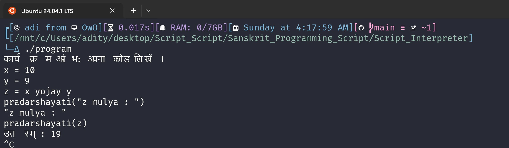

## Welcome to the **Script Interpreter** project! 🚀
This project allows you to interpret a simple script written in a custom language with keywords in Sanskrit. It supports variable assignment, arithmetic operations, conditionals, and print statements.

### ⚙️ **How to Compile and Run**:

1. **Fork the Project**: Start by forking the repository to your GitHub account.  
2. **Set Workflow Permissions**:  
   - Navigate to **Settings** > **Actions** > **General**.  
   - Under **Workflow permissions**, select **Read and write permissions** and save changes.  
3. **Provide Input**: Write your desired command or input in the `input.txt` file.  
4. **Run the Program**: Execute the workflow, and voilà! *(The output will be automatically pushed.)*  
5. **View Output**: The program’s output will be saved in the `output.txt` file for you to review.

### 🛠 **Features**:
- **Addition** ➕ (yojay)
- **Subtraction** ➖ (hrasam)
- **Multiplication** ✖️ (gunam)
- **Division** ➗ (bhagam)
- **Comparison** 🔍 (adhikam, nyunam, samanam, vyatyasam)
- **Logical Negation** ❌ (nasti)
- **Conditionals** ⬇️ (yadi, athava)
- **Loops** 🔄 (punaravrtti, paryantam)
- **Print statements** 🖨️ (pradarshayati)

### **ScreenShots**:
   

